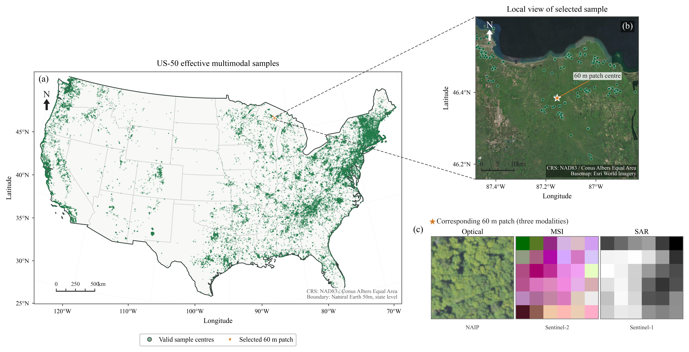

# Forest-LLaVA 多模态树种数据集

English version: [README.md](README.md)

Forest-LLaVA 是面向树种识别和结构化视觉语言研究的多模态遥感数据集。本 GitHub 仓库提供论文对应的数据划分 CSV 和轻量预览材料。完整的 Optical、MSI 和 SAR 处理后影像，以及标签和 Geo 环境记录，统一发布在 [Forest-LLaVA Hugging Face 数据集仓库](https://huggingface.co/datasets/minute1028/forestllava-dataset)。

## 仓库内容

```text
splits/
  us50_formal/             # US-50 正式、按类别分层的划分
  us50_spatial_holdout/    # US-50 0.25° 分块 + 1 km 训练/评价距离缓冲划分
  us200_common_oms/        # US-200 common-OMS 划分
preview/
  figure_3_2_multimodal_patch_example.png
  figure_3_3_valid_sample_spatial_distribution.png
```

划分文件均为 CSV，以 `sample_id` 作为样本级关联键，并保留 GlobalGeoTree 的四层级标签、坐标、来源、观测年份和有效性字段。影像文件名可通过开头的数字 `sample_id` 与 CSV 记录对应。

## 数据集配置

| 配置 | 训练集 | 验证集 | 测试集 | 物种数 | 作用 |
|---|---:|---:|---:|---:|---|
| US-50 正式划分 | 36,312 | 4,552 | 4,551 | 50 | 主要类别分层基准 |
| US-50 空间预留划分 | 35,611 | 4,806 | 4,686 | 50 | 空间敏感性审查 |
| US-200 common-OMS | 138,721 | 17,248 | 17,386 | 200 | 扩展类别基准 |

正式划分主要保证类别覆盖和近似的类内均衡，不保证空间独立。空间预留划分使用 0.25° 空间分块，并在训练集与验证/测试样本之间设置 1 km 中心点距离缓冲；它复用 US-50 影像池，不用于宣称严格跨区域或跨生态区泛化能力。US-200 包含 US-50 样本，因此 Hugging Face 中的两个配置目录会共享部分影像，以支持独立下载。

## 数据来源与模态

每条记录均关联三个公开遥感产品形成的同一块 60 m × 60 m 地面 patch：

- **Optical：** USDA Farm Service Agency National Agriculture Imagery Program（NAIP）航空影像；
- **MSI：** Sentinel-2 Level-2A 多光谱影像；
- **SAR：** Sentinel-1 GRD 双极化雷达影像。

Hugging Face 仓库提供的是经过处理的 TIFF patch，而不是上游机构的原始压缩产品。Optical、MSI 和 SAR 按 `us50/`、`us200/` 分目录保存，每个模态都有分片 manifest 和 SHA-256 校验值；标签与地理环境记录以两个压缩归档提供。

## 数据预览

以下图片展示一个三模态对齐样本以及 US-50 有效样本的空间分布。模态专用显示增强仅用于可视化，不会改变模型输入数值。




## 影像和标签获取

完整处理后影像和标签/Geo 归档请从以下 Hugging Face 数据集仓库下载：

[Hugging Face 数据集：minute1028/forestllava-dataset](https://huggingface.co/datasets/minute1028/forestllava-dataset)

Hugging Face Dataset Card 记录了目录结构、分片大小、样本数量、解压方式、校验值以及三套数据划分之间的关系。用户可以只下载实验所需的配置和模态。

## 来源、许可证与局限

样本索引、分类学标签和相关地理记录来自 GlobalGeoTree。GlobalGeoTree 采用 Creative Commons Attribution 4.0 International（CC BY 4.0）许可；使用这些记录时请引用原始数据集和论文。

Optical 影像源自 USDA FSA NAIP；MSI 和 SAR 影像为由 Forest-LLaVA 预处理流程生成的 Copernicus Sentinel 处理后数据。使用或再分发时请保留 GlobalGeoTree、USDA/FSA/NAIP 和 Copernicus/ESA 的署名，并遵守具体上游产品和采集年份的适用条款。详细声明见 [Hugging Face 第三方数据说明](https://huggingface.co/datasets/minute1028/forestllava-dataset/blob/main/licenses/THIRD_PARTY_NOTICES.md)。第三方源数据的上游条款优先适用，本仓库不授予超出上游条款范围的权利。

由于记录来自开放观测，数据集继承其地理采样格局。正式划分用于可比的类别分层模型评价；空间预留划分用于补充的局部空间邻近敏感性分析。

## 引用

使用本数据集时，请引用 Forest-LLaVA 论文、GlobalGeoTree 原始数据集以及相关 NAIP、Sentinel-1 和 Sentinel-2 产品。当前版本、分片清单和第三方署名信息均维护在 Hugging Face 数据集记录中。
